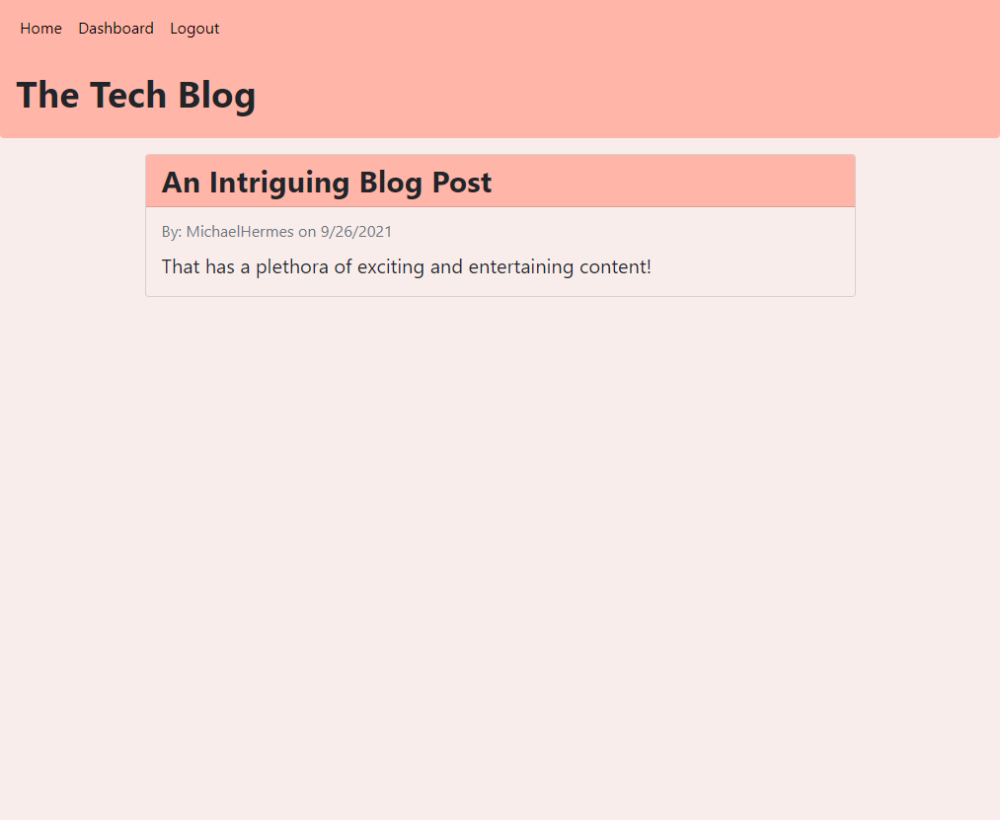

<h1 align="center">Tech Blog</h1>
<h2 align="center">Express Handlebar and Sequelize ORM</h2>

## Description

This is a simple blog post application. Users can register, create blog posts and comment on blog posts. Data is persisted by a MySQL backend. The application is deployed to Heroku and can be found here: [Tech Blog](https://damp-island-96783.herokuapp.com/)

## Table of Contents

- [Usage](#usage)
- [License](#license)
- [How to Contribute](#how-to-contribute)
- [Questions](#questions)

## Usage

[Tech Blog](https://damp-island-96783.herokuapp.com/)

The homepage of the application will present any existing blog posts, however, access to those posts is restricted to authenticated users. Therefore, to get started, a user must either Login as a returning user or Signup as a new user. Upon doing so, they are given full access to the application. They create new blog posts, edit or delete existing blog posts that they've created, or comment on any existing blog posts created by either themselve or another user. At any point, the user may choose to logout to secure their personal dashboard content.

## License

This application is covered under the MIT license. Information about this license can be found [here](http://choosealicense.com/licenses/mit/).

## How to Contribute

[MichaelHermes](https://github.com/MichaelHermes)

## Questions?

Find me on [Github](https://github.com/MichaelHermes) or email me at [mikehermes87@gmail.com](mailto:mikehermes87@gmail.com).
